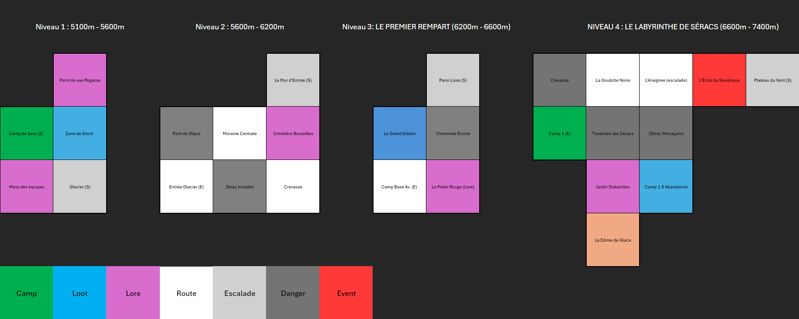
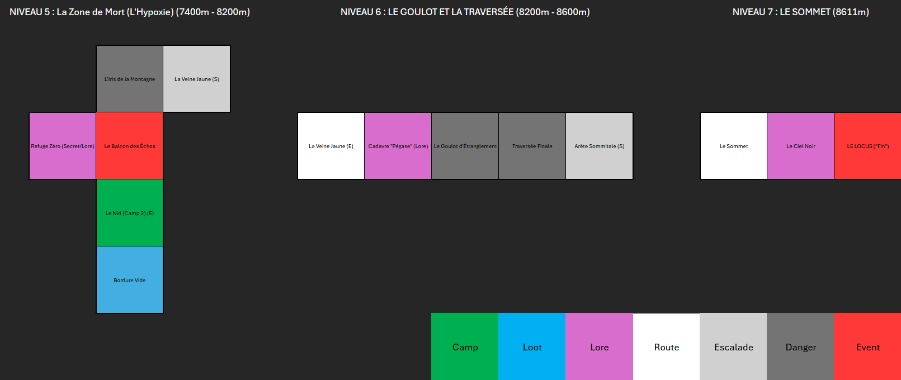

# 🏔️ TBA - Héritage du Sommet

Bienvenue dans **Héritage du Sommet**, un jeu d'aventure textuel immersif (Interactive Fiction) développé en Python. Le joueur incarne un alpiniste bravant les dangers d'une montagne mystique pour en atteindre le sommet légendaire.

<video src="Heritage_Du_Sommet.mp4" controls="controls" style="max-width: 100%;">
  Votre navigateur ne supporte pas la lecture de vidéos.
</video>

## 🏗️ Base de Travail

Ce projet a été construit sur la base du dépôt suivant :
* **Repo original :** [https://github.com/DanielCourivaud/TBA](https://github.com/DanielCourivaud/TBA)

Le code a été étendu et modifié pour inclure une interface graphique, des mécaniques de survie (froid, énergie), des mini-jeux (QTE, Démineur) et un scénario original.

## 📂 Structure du Projet

Voici l'organisation des fichiers sources du jeu :

* `game.py` : Le contrôleur principal. Il initialise le jeu, gère la boucle principale et les conditions de victoire/défaite.
* `GUI.py` : L'interface graphique. Elle capture les entrées utilisateur et affiche les retours du jeu.
* `actions.py` : Contient la logique de toutes les commandes (se déplacer, prendre, parler, etc.).
* `room.py` : Définit les lieux, leurs sorties et leur contenu.
* `player.py` : Gère l'état du joueur (inventaire, statistiques de survie).
* `quest.py` : Gestionnaire des quêtes et des objectifs.
* `character.py` : Gestion des PNJ et des dialogues.
* `epreuve_danger.py` & `qte.py` : Mini-jeux (traversée de zones dangereuses et escalade).
* `data.json` : Fichier de configuration contenant la structure du monde (salles et objets).

## 🎯 But du Jeu

L'objectif ultime est d'atteindre le **Toit du Monde**, un lieu mystique appelé **LE LOCUS**.

Cependant, l'ascension brute ne suffit pas. Pour remporter la **VICTOIRE ABSOLUE**, vous devez :
1.  Gérer vos constantes vitales (Énergie, Mental, Chaleur).
2.  Explorer les différents camps et zones géologiques.
3.  **Accomplir la totalité des quêtes** disponibles avant d'atteindre le sommet.

## 🎮 Commandes et Interface

Le jeu peut être contrôlé via des commandes textuelles ou via l'interface graphique. Certaines actions nécessitent impérativement l'utilisation du clavier.

| Commande Terminal | Paramètres | Description | Substitut Graphique (GUI) |
| :--- | :--- | :--- | :--- |
| `go` | `N`, `E`, `S`, `O` | Se déplacer vers un point cardinal. | ⬆️ ⬇️ ⬅️ ➡️ (Boutons fléchés) |
| `go` | `U`, `D` | Monter (`U`) ou Descendre (`D`) (Changement d'altitude). | ❌ **Aucun** (Doit être tapé) |
| `look` | Aucun | Observer la zone actuelle et les objets au sol. | 👁️ Bouton "Regarder" |
| `talk` | `<nom>` | Parler à un personnage présent. | 🗣️ Bouton "Parler" (Remplace "Regarder" si PNJ présent) |
| `take` | `<objet>` | Ramasser un objet. | ❌ **Aucun** (Doit être tapé) |
| `drop` | `<objet>` | Poser un objet de l'inventaire. | ❌ **Aucun** (Doit être tapé) |
| `check` | Aucun | Vérifier le contenu de son inventaire. | 🎒 Bouton "Inventaire" |
| `use` | `<objet>` | Utiliser un consommable (Soin, Chaleur). | ❌ **Aucun** (Doit être tapé) |
| `quests` | Aucun | Afficher le journal des quêtes. | 📜 Bouton "Quêtes" |
| `quest` | `<nom>` | Afficher le détail d'une quête spécifique. | ❌ **Aucun** (Doit être tapé) |
| `escalade` | Aucun | Tenter de grimper une paroi (Lance un QTE). | 🧗 Bouton "Grimper" |
| `help` | Aucun | Afficher l'aide. | ❓ Bouton "Aide" |
| `quit` | Aucun | Quitter le jeu. | 🚪 Bouton "Quitter" |
| `history` | Aucun | Voir les lieux visités. | ❌ **Aucun** |
| `back` | Aucun | Revenir à la salle précédente. | ❌ **Aucun** |

## 👥 Personnages Non-Joueurs (PNJ)

Au cours de votre ascension, vous rencontrerez des figures clés :

* **Le Sherpa** : Un guide expérimenté au visage marqué par le soleil. Il se trouve généralement au point de départ ou dans les camps avancés. Il dispense des conseils cruciaux sur la mécanique de l'escalade et les dangers du glacier.

*(D'autres personnages peuvent être découverts en explorant la montagne)*

## 🎒 Objets du Jeu

L'équipement est vital pour la survie. Voici les objets que vous pouvez trouver :

### 🛠️ Équipement Technique (Passifs)
Ces objets améliorent vos statistiques ou vos chances de réussite tant qu'ils sont dans votre inventaire.

* **Piolet** : Un piolet technique en acier trempé. Indispensable pour grimper.
* **Piolet Carbone** : Version améliorée à lame courbée. Facilite grandement l'escalade (Bonus QTE).
* **Bâtons** : En carbone léger. Soulagent l'effort de marche (Réduit la perte d'énergie).
* **Sonde** : Tige métallique pour sonder la neige (Aide à traverser les zones dangereuses/mines).
* **Lunettes** : Augmentent les contrastes (Aide à traverser les zones dangereuses/mines).
* **Couverture** : Fine feuille dorée de survie (Réduit la perte de chaleur).
* **Veste** : Armure de plumes rouges. Isolation totale (Réduit considérablement la perte de chaleur).
* **Masque** : Enrichit l'air raréfié en oxygène (Réduit la perte d'énergie en haute altitude).
* **Magnésie** : Sèche les mains pour une adhérence parfaite (Réduit la difficulté des phases de QTE).

### 💊 Consommables
Ces objets doivent être utilisés avec la commande `use <objet>` pour faire effet (Usage unique).

* **Thermos** : Mélange tibétain au beurre de yak (+40 Chaleur).
* **Chaufferette** : Sachet chimique à craquer (+10 Chaleur).
* **Gel** : Pâte sucrée énergétique (+25 Énergie).
* **Ration** : Boîte de conserve riche en graisse (+50 Énergie).

## ⚔️ Quêtes Disponibles

Pour triompher, vous devrez valider les étapes suivantes :

1.  **Sécurité avant tout** : Trouver un **Piolet** au Mess des officiers pour assurer votre sécurité.
2.  **Bienvenue** : Écouter la sagesse du Sherpa avant de partir.
3.  **Première Ascension** : Réussir à grimper la première paroi verticale du glacier.
4.  **Le toit du monde** : Atteindre la salle finale, le LOCUS, en vie.

## 🎮 Mode développeur

Pour tester le jeu sans se confronter à la dificulté du jeu, il y a un **GODMODE** dans lequel le joueur est invincible et les épreuves sont automatiques.
Pour lancer le jeu en **GODMODE**, allez dans la classe player du fichier player.py et passer la variable global **GODMODE** à `True`.

## 🗺️ Cartographie
Voici les plans de l'ascension pour vous aider à vous repérer :

## 📊 Architecture technique
Pour une vue détaillée de la structure du code, vous pouvez consulter le :

*Cliquez sur l'image pour ouvrir le fichier PDF complet.*

---
*Bonne chance pour l'ascension. La montagne vous observe.*

